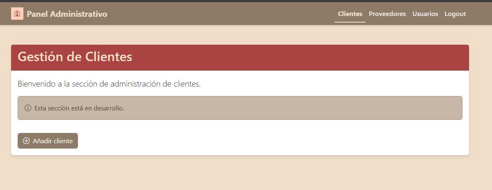
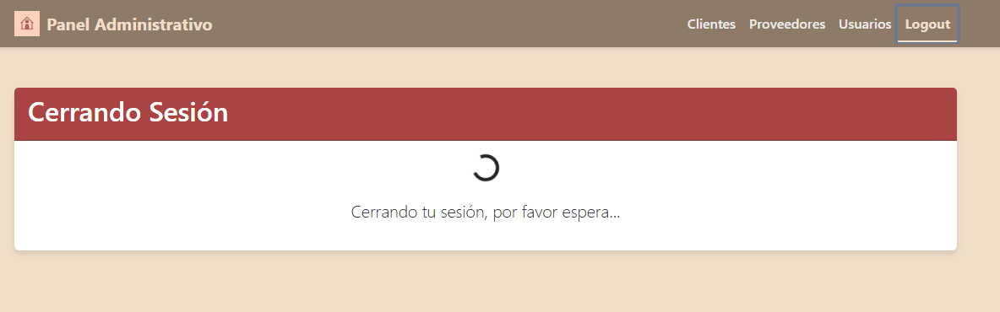

# Panel Administrativo con React y Vite

Este proyecto es un panel administrativo desarrollado con React, Vite y Bootstrap
para una tienda de venta de muebles.

## Características

- Barra de navegación con logo
- Navegación con React Router DOM
- Secciones: Clientes, Proveedores, Usuarios y Logout
- Diseño responsive con Bootstrap
- Transiciones y efectos visuales

## Tecnologías utilizadas

- React
- Vite
- React Router DOM
- Bootstrap

## Instrucciones de instalación

1. Clonar el repositorio
2. Ejecutar `npm install` para instalar dependencias
3. Ejecutar `npm install react-router-dom bootstrap`
4. Ejecutar `npm install bootstrap-icons`
5. Ejecutar `npm run dev` para iniciar el servidor de desarrollo

## Capturas de pantalla

## Autor

Nery Karolina Aponte Barajas - 2202021
Entornos de programacion grupo E1

## Profesor

Carlos Adolfo Beltrán Castro
# Panel Administrativo con React y Vite

Este proyecto es un panel administrativo desarrollado con React, Vite y Bootstrap.

## Características

- Barra de navegación con logo
- Navegación con React Router DOM
- Secciones: Clientes, Proveedores, Usuarios y Logout
- Diseño responsive con Bootstrap
- Transiciones y efectos visuales

## Tecnologías utilizadas

- React
- Vite
- React Router DOM
- Bootstrap

## Instrucciones de instalación

1. Clonar el repositorio
2. Ejecutar `npm install` para instalar dependencias
3. Ejecutar `npm install react-router-dom bootstrap`
4. Ejecutar `npm install bootstrap-icons`
5. Ejecutar `npm run dev` para iniciar el servidor de desarrollo

## Capturas de pantalla

## Autor

Nery Karolina Aponte Barajas - 2202021
Entornos de programacion grupo E1

## Profesor

Carlos Adolfo Beltrán Castro